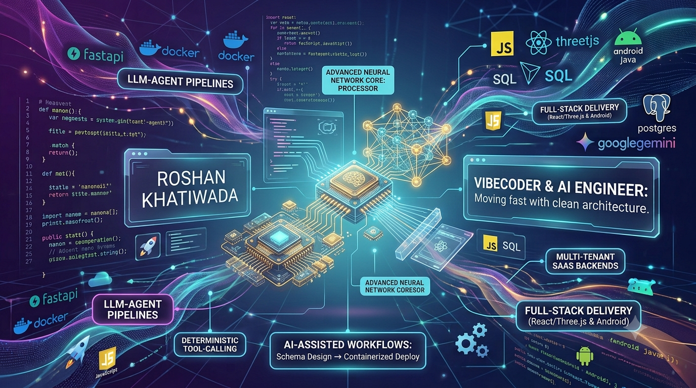

### 🔗 Connect with me

  
  
  
  

---

### 😊 About Me

- 🧠 AI/Backend Engineer building **LLM-agent pipelines** and **multi-tenant SaaS backends**
- ⚙️ I design async Python APIs and relational schemas, and wire deterministic tool-calling around LLMs so agents assist without inventing critical data
- 🌐 I also build **React/Three.js** web experiences and native **Android** apps
- 🚀 Comfortable owning a service end-to-end: schema design → API → containerized deploy → CI/CD
- ⚡ Vibecoder at heart — I move fast with AI-assisted workflows to prototype, iterate, and ship without losing sight of clean architecture
- 📫 How to reach me: [riteshrooson@gmail.com](mailto:riteshrooson@gmail.com)

---

### 🎯 What I Do

<table>
<tr>
<td width="50%" valign="top">

**🤖 AI Agent Systems**
Designing LLM-agent pipelines that extract, enrich, and validate structured data from documents — using tool-calling to keep the LLM's role limited to language, while deterministic Python code owns every numeric or regulated value.

</td>
<td width="50%" valign="top">

**🗄️ Backend & Data Architecture**
Building async, multi-tenant APIs on FastAPI + PostgreSQL — org-scoped auth, service-layer business logic separated from HTTP routing, and migration safety guards that catch schema drift before it breaks production.

</td>
</tr>
<tr>
<td width="50%" valign="top">

**🖥️ Full-Stack Delivery**
Shipping complete products end-to-end — from interactive React/Three.js frontends to native Android apps — with an eye for UI polish and real-time feedback (live stats, animations, responsive layouts).

</td>
<td width="50%" valign="top">

**⚙️ DevOps & Reliability**
Containerizing services with Docker, wiring CI/CD for automated builds and zero-downtime rolling deploys, and load-balancing across replicas rather than shipping a single point of failure.

</td>
</tr>
</table>

---

### 🛠️ Tech Stack

  

**Backend & Databases**

  
  
  
  
  
  

**AI / LLM Engineering**

  
  
  
  
  
  

**Frontend & Mobile**

  
  
  
  

**DevOps & Tooling**

  
  
  
  

**Ways of Working**

  
  
  

---

### 🏆 Highlights

  
  
  

### 📊 GitHub Stats

  
  

  

  

